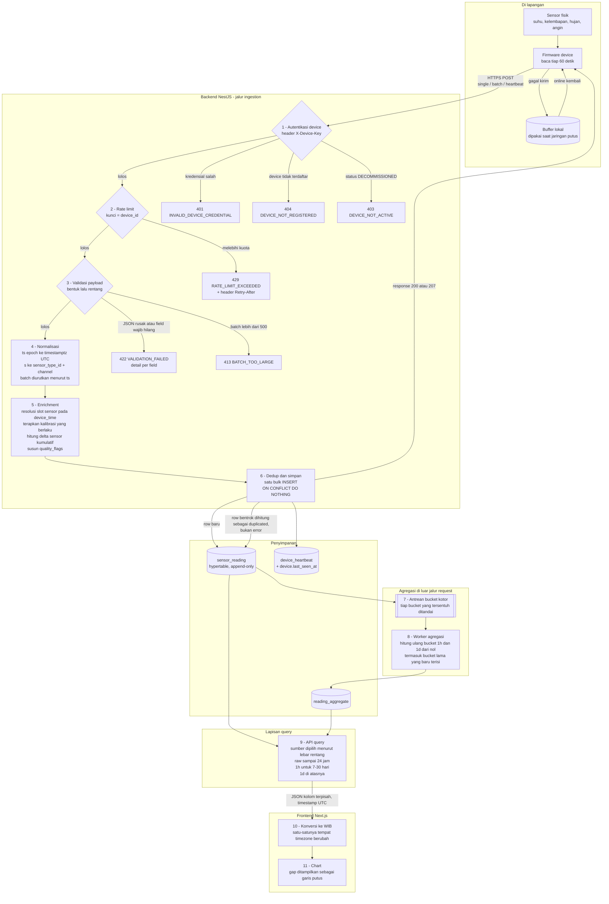

# Alur Data — dari Sensor Fisik sampai Chart

Sumber diagram: [`data-flow.mmd`](data-flow.mmd) dan [`data-flow-sequence.mmd`](data-flow-sequence.mmd).

---

## 1. Diagram alur



---

## 2. Penjelasan tiap tahap

| # | Tahap | Yang terjadi | Kenapa di situ |
|---|---|---|---|
| 0 | **Sensor fisik** | Tegangan/pulsa diubah firmware menjadi angka. `rain_counter` bukan hasil pengukuran melainkan pencacah tipping bucket yang hanya bertambah. | — |
| 0 | **Firmware + buffer** | Membaca tiap 60 detik, menstempel `ts` dari jam internalnya, dan menaikkan `seq`. Bila pengiriman gagal, payload ditumpuk di buffer lokal. | Buffer inilah sumber data terlambat dan duplikat. Backend harus menganggap keduanya normal, bukan anomali. |
| 0 | **Transport** | HTTPS POST ke tiga endpoint: `/ingest/telemetry`, `/ingest/telemetry/batch`, `/ingest/heartbeat`. | HTTP dipilih karena device sudah terlanjur dibuat. Desainnya tetap memungkinkan MQTT ditambahkan sebagai transport kedua — lapisan 1–6 tidak perlu berubah karena tidak bergantung pada protokol. |
| 1 | **Autentikasi device** | Header `X-Device-Key: <key_id>.<secret>`. `key_id` dicari (satu lookup index unik), lalu `SHA-256(secret + pepper)` dibandingkan dengan `secret_hash` memakai perbandingan waktu-tetap. | Paling depan, sebelum parsing apa pun, supaya request tak sah tidak pernah menyentuh CPU untuk validasi maupun database. |
| 2 | **Rate limit** | Kuota per `device_id` (bukan per IP), default 120 request/menit. | Setelah autentikasi, karena kuncinya adalah identitas device yang baru diketahui setelah autentikasi berhasil. |
| 3 | **Validasi payload** | Dua lapis: *bentuk* (field wajib ada, tipe benar, batch ≤ 500) lalu *rentang* (nilai dibandingkan `min_valid`/`max_valid` tipe sensor). | Pelanggaran bentuk = tolak; pelanggaran rentang = **terima dengan tanda**. Pembedaan ini penting: payload cacat tidak bisa dipercaya, tapi nilai aneh dari sensor adalah fakta lapangan yang justru perlu disimpan. |
| 4 | **Normalisasi** | `ts` epoch detik → `timestamptz` UTC; `"s"` → `sensor_type_id` + `channel`; batch diurutkan menurut `ts` menaik. | Pengurutan wajib dilakukan sebelum tahap 5, karena perhitungan delta `rain_counter` bergantung pada urutan kronologis — dan soal secara eksplisit menyebut data bisa datang tidak berurutan. |
| 5 | **Enrichment** | (a) Cari instalasi yang memegang slot `(device, tipe, channel)` pada `device_time` → dapat `sensor_id`. (b) Cari kalibrasi yang berlaku pada `device_time` → `value = raw * scale + offset`. (c) Untuk sensor kumulatif, hitung `delta_value` terhadap pembacaan sebelumnya. (d) Susun `quality_flags`. | Semuanya memakai `device_time`, **bukan** waktu sekarang. Inilah yang membuat data yang datang terlambat tetap mendapat sensor dan kalibrasi yang benar menurut kondisi saat data itu diukur. |
| 6 | **Dedup + simpan** | Satu `INSERT ... ON CONFLICT DO NOTHING` untuk seluruh batch. Jumlah row yang benar-benar masuk dibandingkan jumlah yang dikirim → selisihnya adalah `duplicated`. | Dedup diserahkan ke constraint database, bukan ke pengecekan `SELECT` lebih dulu. Cek-lalu-tulis punya celah balapan antara dua request bersamaan; constraint tidak. |
| 7–8 | **Agregasi** | Setiap bucket jam/hari yang tersentuh data baru ditandai "kotor", lalu worker menghitung ulang bucket tersebut dari data mentah. | Dipisah dari jalur request supaya ingestion tidak menunggu agregasi. Karena yang dihitung ulang adalah bucket yang tersentuh — bukan hanya bucket terbaru — data terlambat otomatis memperbaiki agregat lama. |
| 9 | **API query** | Memilih sumber data menurut lebar rentang yang diminta, memaksa `interval` minimum, dan membatasi jumlah titik. | Keputusan ini ada di server, bukan di klien, supaya tidak ada satu pun cara bagi frontend untuk meminta 184 juta row. |
| 10–11 | **Frontend** | Menerima UTC, mengubah ke WIB hanya saat render, menggambar gap sebagai garis putus. | Satu-satunya tempat timezone berubah di seluruh sistem. |

---

## 3. Skenario gabungan: offline 3 jam, lalu duplikat

```mermaid
sequenceDiagram
    autonumber
    participant D as Device WS-GRT-001
    participant A as API ingestion
    participant DB as TimescaleDB
    participant W as Worker agregasi
    participant F as Dashboard

    Note over D: Jaringan putus pukul 01:00 UTC<br/>pembacaan ditumpuk di buffer lokal

    loop setiap 60 detik selama 3 jam
        D-->>D: simpan ke buffer, seq bertambah
    end

    Note over D: Jaringan pulih pukul 04:00 UTC

    D->>A: POST /ingest/telemetry/batch (180 record)
    A->>A: autentikasi X-Device-Key, cek rate limit
    A->>A: validasi bentuk dan rentang tiap record
    A->>A: urutkan menurut ts, resolusi sensor, kalibrasi, quality flag
    A->>A: hitung delta rain_counter secara berurutan
    A->>DB: satu bulk INSERT 180 row, ON CONFLICT DO NOTHING
    DB-->>A: 180 row masuk
    A->>DB: tandai bucket jam 01, 02, 03, 04 sebagai kotor
    A-->>D: 200 { accepted: 180, duplicated: 0, rejected: 0 }

    Note over D,A: ACK tidak sampai ke device karena koneksi terputus lagi

    D->>A: POST /ingest/telemetry/batch (180 record yang SAMA)
    A->>DB: bulk INSERT, ON CONFLICT DO NOTHING
    DB-->>A: 0 row masuk, 180 bentrok
    A-->>D: 200 { accepted: 0, duplicated: 180, rejected: 0 }
    Note over A: Duplikat bukan error. Device berhenti mengirim ulang<br/>karena akhirnya menerima 2xx.

    W->>DB: baca antrean bucket kotor
    W->>DB: hitung ulang reading_aggregate jam 01 sampai 04
    Note over W: Agregat jam yang tadi kosong kini terisi;<br/>yang sudah terlanjur dihitung ditimpa nilai baru

    F->>A: GET /readings?device_id=...&from=...&to=...&interval=1h
    A->>DB: baca reading_aggregate
    DB-->>A: deret bucket per jam
    A-->>F: JSON format kolom, timestamp UTC
    F->>F: konversi ke WIB, render chart
```

---

## 4. Pertanyaan wajib Bagian D

### D.1 — Idempotensi

**Mekanismenya: unique key + upsert, ditegakkan oleh database.**

Kunci idempotensinya adalah primary key `sensor_reading`:

```
(device_id, sensor_type_id, channel, device_time)
```

Penulisannya:

```sql
INSERT INTO sensor_reading (...) VALUES (...), (...), ...
ON CONFLICT (device_id, sensor_type_id, channel, device_time) DO NOTHING;
```

Jumlah row yang benar-benar masuk dibandingkan dengan jumlah yang dikirim; selisihnya dilaporkan sebagai `duplicated`.

**Kenapa kunci itu, dan bukan `seq`.** `seq` terlihat menggoda karena memang nomor urut, tetapi soal menyebutkan `seq` **reset ke 0 setiap device restart**. Device yang restart dua kali dalam sehari akan menghasilkan `seq = 1` sebanyak tiga kali dengan isi berbeda — sebagai kunci unik, itu akan menolak data yang sah. `device_time` tidak punya masalah ini: dua pembacaan berbeda dari sensor yang sama pada detik yang sama memang mustahil secara fisik. `seq` tetap disimpan, tapi hanya untuk diagnosa.

**Kenapa `DO NOTHING`, bukan `DO UPDATE`.** Data time-series bersifat append-only. Kalau row dengan kunci sama sudah ada, isinya sudah pasti identik — device mengirim ulang payload yang sama persis. Menimpanya hanya membuang I/O dan, pada chunk yang sudah terkompresi, jauh lebih mahal.

**Tidak ada dedup window berbasis waktu.** Dedup berbasis jendela waktu (misalnya "abaikan yang sama dalam 5 menit terakhir") akan gagal justru pada kasus yang paling sering terjadi di sini: device yang offline 3 jam lalu mengirim ulang batch-nya jauh di luar jendela apa pun. Constraint pada primary key berlaku selamanya dan tidak punya lubang seperti itu.

**Idempotensi di tingkat batch.** Batch tidak diperlakukan sebagai satu unit atomik. Setiap record berdiri sendiri, sehingga batch yang separuh isinya duplikat tetap menyimpan separuh yang baru — device tidak perlu tahu bagian mana yang sudah sampai. Ini juga yang membuat response `207` bermakna: `{ accepted: 8, duplicated: 2 }`.

### D.2 — Data terlambat dan tidak berurutan

**Saat masuk.** 180 record diurutkan menurut `ts` menaik terlebih dahulu. Pengurutan ini bukan kosmetik — perhitungan delta `rain_counter` bergantung pada urutan kronologis, dan kalau batch diproses sesuai urutan kedatangan yang acak, deltanya akan kacau.

Semua pencarian di tahap enrichment memakai `device_time`, bukan `now()`. Record dari pukul 01:00 yang baru tiba pukul 04:00 tetap mendapat instalasi sensor dan nilai kalibrasi yang berlaku pukul 01:00.

Penyimpanannya sendiri tidak masalah: hypertable menerima insert ke chunk lama seperti biasa. Satu-satunya biaya adalah insert menjadi tersebar ke beberapa chunk, bukan terpusat di chunk terbaru. Kalau chunk tujuannya sudah terkompresi (> 30 hari), TimescaleDB menerimanya lewat mekanisme *decompress-on-write* yang lebih lambat — dapat diterima, karena data yang terlambat lebih dari 30 hari seharusnya sangat jarang.

**Efeknya pada agregat jam yang sudah terlanjur dihitung.** Inilah bagian yang penting. Ingestion tidak langsung menghitung agregat; ia **menandai bucket yang tersentuh sebagai kotor**. Batch tadi menyentuh jam 01, 02, 03, dan 04, jadi keempatnya masuk antrean. Worker kemudian **menghitung ulang bucket tersebut dari nol** berdasarkan data mentah yang sekarang ada, lalu menimpanya (`INSERT ... ON CONFLICT DO UPDATE`).

Konsekuensinya jelas dan saya terima: agregat bersifat *eventually consistent*. Ada jeda beberapa detik sampai satu menit antara data masuk dan agregat menjadi benar. Sebagai gantinya, agregat selalu **konvergen ke nilai yang benar**, tidak peduli seberapa terlambat atau seberapa acak urutan datangnya data.

Alternatif yang saya tolak adalah agregat inkremental (menambahkan nilai baru ke agregat lama tanpa menghitung ulang). Cara itu lebih cepat, tetapi tidak bisa dibuat idempoten: satu pemrosesan ganda akan menggandakan total curah hujan secara permanen, tanpa jejak. Menghitung ulang seluruh bucket selalu menghasilkan angka yang sama berapa kali pun dijalankan — dan pada bucket satu jam yang isinya paling banyak 60 row, biayanya memang murah.

> Catatan TimescaleDB: dengan *continuous aggregate*, gagasannya sama persis — yang berubah hanya siapa yang mengurus pembukuannya. Timescale melacak sendiri bagian mana dari agregat yang kedaluwarsa dan menyegarkannya lewat `refresh_continuous_aggregate`. Saya memilih tabel + worker sendiri karena dengan begitu penanganan data terlambat sepenuhnya eksplisit dan bisa saya uji, ketimbang bergantung pada `refresh_lag` yang harus disetel dengan benar.

### D.3 — Backpressure

Beban puncaknya moderat — 50 device × 7 sensor = 350 row/menit ≈ 6 row/detik untuk pengiriman normal. Yang berbahaya adalah **lonjakan serentak**: kalau listrik di satu wilayah padam lalu pulih bersamaan, 50 device bisa sekaligus mengirim batch 180 record, yaitu ~63.000 row dalam hitungan detik.

Strategi bertingkat, dari yang paling murah:

1. **Bulk insert, satu perjalanan ke database.** Satu batch 500 record = satu `INSERT` multi-VALUES, bukan 500 `INSERT`. Ini saja sudah memperbaiki throughput sekitar dua orde besaran (lihat JAWABAN.md no. 4).
2. **Batasi ukuran batch (500).** Membuat penggunaan memori per request punya batas atas yang pasti dan mencegah satu request memonopoli koneksi database terlalu lama.
3. **Rate limit per device (120/menit).** Device yang rusak dan mengirim tanpa henti tidak bisa menjatuhkan layanan bagi 49 device lainnya.
4. **Connection pool dengan batas antrean.** Pool Prisma dibatasi; ketika penuh, request menunggu sampai batas waktu lalu dijawab `503 SERVICE_UNAVAILABLE` dengan header `Retry-After`. Menolak cepat lebih baik daripada menumpuk request sampai kehabisan memori.
5. **Agregasi keluar dari jalur request.** Ingestion hanya menulis penanda bucket kotor. Pekerjaan berat terjadi di worker, sehingga lonjakan ingestion tidak ikut memperlambat respons ke device.

**Yang belum saya kerjakan, dan kapan dibutuhkan:** antrean tahan-mati (Redis Stream, Kafka, atau MQTT dengan QoS 1) di depan database, sehingga ingestion hanya menulis ke antrean dan worker yang mengalirkannya ke database sesuai kecepatan yang sanggup ditanggung. Untuk 50 device, itu kompleksitas yang belum terbayar. Ambang yang saya pakai sebagai penanda: ketika lonjakan rutin melampaui kemampuan database menulis, atau ketika kehilangan data saat database down menjadi tidak dapat diterima (lihat D.6).

### D.4 — `device_time` vs `server_time`

| | `device_time` | `server_time` |
|---|---|---|
| Asal | Field `ts` dari payload, jam internal device | `now()` saat request diterima |
| Bisa salah? | Ya — RTC melayang, baterai habis, belum sinkron NTP setelah restart | Tidak, server tersinkron NTP |
| Bisa mundur atau lompat? | Ya | Tidak |

**Yang menjadi acuan time-series adalah `device_time`.** Alasannya: yang ingin diketahui pengguna adalah *kapan cuacanya begitu*, bukan *kapan datanya sampai ke server*. Kalau `server_time` yang dipakai sebagai sumbu waktu, 180 record hasil buffer selama 3 jam akan menumpuk di satu titik pukul 04:00, dan grafik suhu tiga jam itu menjadi bohong. Karena itu `device_time` pula yang menjadi kolom partisi hypertable dan bagian dari kunci idempotensi.

**`server_time` tetap disimpan** karena tiga hal tidak bisa dijawab tanpanya: seberapa terlambat data ini (`server_time - device_time`), apakah jam device melayang, dan kapan sebenarnya sistem kita menerima baris ini saat mengaudit.

**Menangani clock drift.** Selisih keduanya dihitung untuk setiap payload:

| Selisih | Perlakuan |
|---|---|
| ≤ 5 menit (`CLOCK_DRIFT_TOLERANCE_SECONDS`) | Normal — termasuk latensi jaringan biasa. Tanpa tanda. |
| `device_time` **di masa depan** lebih dari toleransi | Diterima, ditandai `FUTURE_TIMESTAMP`. Nilainya tetap disimpan apa adanya; yang dilakukan sistem adalah mencatat bahwa jamnya tidak bisa dipercaya. |
| `device_time` **di masa lalu** lebih dari toleransi | Normal untuk data buffered. Ditandai `LATE_ARRIVAL` hanya bila keterlambatannya melebihi ambang data buffered yang wajar. |
| `device_time` lebih maju dari 24 jam | Ditolak `422`. Pada titik ini jamnya jelas rusak, dan menerimanya berarti menyuntikkan titik data ke masa depan yang akan mengacaukan sumbu semua chart. |

Yang sengaja **tidak** saya lakukan adalah mengoreksi `device_time` dengan menggesernya sebesar drift yang terdeteksi. Itu berarti mengubah data mentah berdasarkan tebakan, dan kalau tebakannya salah kita kehilangan kedua versinya. Menyimpan keduanya beserta tandanya membuat koreksi masih bisa dilakukan kapan saja di kemudian hari.

### D.5 — Timezone

**Aturannya satu kalimat: UTC di mana-mana, WIB hanya di piksel.**

| Lapisan | Perlakuan |
|---|---|
| Device | Mengirim `ts` sebagai Unix epoch detik, yang menurut definisinya UTC. Tidak ada ambiguitas. |
| Container database | `TZ=UTC` dan `PGTZ=UTC` di `docker-compose.yml`. Semua kolom bertipe `timestamptz`. |
| Proses backend | `process.env.TZ = 'UTC'` dipasang sebagai baris pertama di [`main.ts`](../apps/api/src/main.ts), sebelum modul apa pun dimuat. Akibatnya `new Date()` dan semua log memakai UTC tanpa bergantung pada timezone mesin yang menjalankannya. |
| Response API | ISO 8601 dengan akhiran `Z`, contoh `2026-09-21T03:15:00.000Z`. |
| **Frontend** | **Satu-satunya tempat konversi terjadi**, memakai `Intl.DateTimeFormat` dengan `timeZone: 'Asia/Jakarta'` saat render. |

**Kenapa konversinya di frontend, bukan di API.** Kalau API mengirim waktu yang sudah dalam WIB, nilai itu berhenti menjadi titik waktu absolut dan berubah menjadi tampilan — dan setiap konsumen berikutnya (aplikasi mobile, ekspor CSV, integrasi pihak ketiga) harus menebak zona apa yang sudah diterapkan. Mengirim UTC menjaga API tetap netral; siapa pun yang menampilkan, dialah yang memutuskan zonanya.

**Satu pengecualian yang perlu disadari:** agregat harian. Bucket `DAY_1` dihitung dengan batas tengah malam **UTC**, sedangkan "total curah hujan hari ini" menurut pengguna berarti tengah malam **WIB** — bergeser 7 jam. Untuk endpoint `/readings/summary` yang memang berorientasi kalender lokal, pengelompokannya dilakukan dengan `date_trunc('day', device_time AT TIME ZONE 'Asia/Jakarta')` sehingga batas harinya benar menurut WIB. Perbedaan ini dicantumkan pada dokumentasi endpoint agar tidak menjadi jebakan diam-diam.

### D.6 — Kalau database down saat payload masuk

**Jawaban jujurnya: pada arsitektur sekarang, data bisa hilang — dan hilangnya dicegah oleh device, bukan oleh backend.**

Urutan yang terjadi:

1. Bulk insert gagal; Prisma melempar error koneksi.
2. Exception filter mengubahnya menjadi **`503 SERVICE_UNAVAILABLE`** dengan `Retry-After`, bukan `500`. Bedanya penting: `503` memberi tahu device bahwa ini gangguan sementara dan payloadnya layak dikirim ulang.
3. Device tidak menerima `2xx`, sehingga **payload tetap berada di buffer lokalnya** dan akan dikirim ulang nanti.
4. Ketika database pulih, device mengirim ulang; idempotensi (D.1) menjamin data yang sempat masuk sebelum kegagalan tidak menjadi ganda.

Jadi **buffer device itulah durabilitas sistem ini**, dan itu sah karena soal menyatakan device memang menyimpan data yang tertahan. Yang tidak boleh dilakukan backend adalah menjawab `2xx` sebelum data benar-benar tersimpan — karena itu akan membuat device menghapus buffer-nya, dan di situlah data hilang untuk selamanya.

**Batas dari pendekatan ini.** Data tetap hilang bila database down lebih lama daripada daya tahan buffer device. Kalau device menyimpan 24 jam terakhir dan database mati 30 jam, 6 jam paling awal hilang tanpa bisa dipulihkan.

**Yang akan saya tambahkan bila itu tidak dapat diterima:** *write-ahead queue* di sisi backend — payload yang sudah lolos autentikasi dan validasi ditulis ke antrean tahan-mati (Redis AOF, Kafka, atau bahkan berkas append-only) sebelum dijawab `202 Accepted`, lalu worker mengalirkannya ke database. Yang ditukar: konfirmasi ke device berubah dari "sudah tersimpan" menjadi "sudah diterima", dan muncul satu komponen lagi yang bisa gagal. Untuk 50 device dengan buffer di sisinya, saya menilai pertukaran itu belum sepadan — tetapi keputusan ini dicatat di sini supaya alasannya bisa ditinjau ulang saat skalanya berubah.
