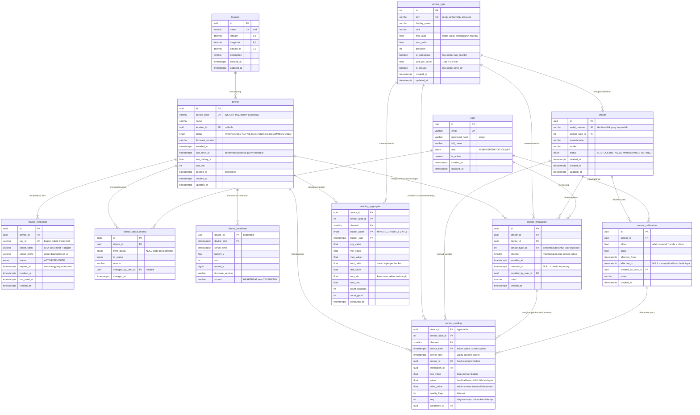

# ERD — Platform Monitoring Stasiun Cuaca

Sumber diagram: [`erd.mmd`](erd.mmd) (Mermaid, ter-render otomatis di bawah) dan [`erd.dbml`](erd.dbml) (untuk dbdiagram.io).
Skema yang benar-benar dieksekusi ada di [`apps/api/prisma/schema.prisma`](../apps/api/prisma/schema.prisma) dan [file migrasi](../apps/api/prisma/migrations/).

---

## 1. Diagram



---

## 2. Kardinalitas

| Relasi | Kardinalitas | Catatan |
|---|---|---|
| `location` → `device` | 1 — 0..N | Satu lokasi bisa menampung beberapa device, dan bisa kosong saat device-nya dicabut. |
| `device` → `device_credential` | 1 — 1..N | Selalu ada minimal satu kredensial; sementara ada lebih dari satu **aktif** hanya selama masa tenggang rotasi. |
| `device` → `device_status_history` | 1 — 1..N | Baris pertama dibuat saat device didaftarkan (`NULL → PROVISIONED`). |
| `sensor_type` → `sensor` | 1 — 0..N | Tipe adalah master data; sensor fisik adalah instansinya. |
| **`device` ↔ `sensor`** | **N — M sepanjang waktu** | Tidak pernah dimodelkan sebagai relasi langsung. Dipecahkan oleh `sensor_installation` yang membawa dimensi waktu, sehingga pertanyaan "sensor apa yang ada di device ini" selalu berarti "…pada waktu kapan". |
| `sensor` → `sensor_calibration` | 1 — 0..N | Berderet dalam waktu, tidak tumpang tindih (dijamin exclusion constraint). |
| `device` → `sensor_reading` | 1 — 0..N | Relasi logis; **tanpa foreign key fisik** (lihat §4). |
| `sensor_installation` → `sensor_reading` | 1 — 0..N | Hasil resolusi saat ingestion, disimpan agar tidak perlu dihitung ulang saat query. |

---

## 3. Daftar index dan query yang dilayaninya

Setiap index di bawah ini dibuat untuk satu query nyata. Index yang tidak bisa saya sebutkan query-nya, tidak saya buat.

### `sensor_reading` (tabel terpanas)

| Index | Kolom | Query yang dilayani |
|---|---|---|
| `sensor_reading_pkey` | `(device_id, sensor_type_id, channel, device_time)` | **Dua peran sekaligus.** (a) Kunci idempotensi: `ON CONFLICT DO NOTHING` saat payload dikirim ulang. (b) Query chart utama `GET /readings?device_id=&sensor_type=&from=&to=` — tiga kolom pertama dipakai dengan `=`, kolom waktu dengan `BETWEEN`. |
| `sensor_reading_device_id_device_time_idx` | `(device_id, device_time DESC)` | "Semua sensor milik satu device dalam rentang waktu" — halaman detail stasiun yang menarik 7 tipe sensor sekaligus. PK tidak bisa melayani ini secara efisien karena `sensor_type_id` di posisi kedua tidak difilter. |
| `sensor_reading_device_time_idx` | `(device_time DESC)` | Dibuat otomatis oleh `create_hypertable`. Dipakai untuk chunk exclusion dan query lintas device (dashboard overview). |
| `sensor_reading_latest_idx` | `(device_id, sensor_type_id, channel, device_time DESC) INCLUDE (value, raw_value, quality_flags)` | `GET /devices/{id}/readings/latest`. Kolom `INCLUDE` membuatnya **index-only scan**: nilai terkini seluruh sensor didapat tanpa menyentuh heap sama sekali. |
| `sensor_reading_flagged_idx` | `(device_id, device_time DESC) WHERE quality_flags <> 0` | Halaman diagnosa "pembacaan bermasalah". Dibuat **parsial** karena barisnya sedikit — index-nya ikut kecil dan murah dirawat. |

> **Trade-off yang saya sadari:** `sensor_reading_latest_idx` adalah index termahal di sistem ini (perkiraan ~11 GB/tahun, lihat §5) dan kolom kuncinya sama persis dengan PK, hanya arah urutan dan `INCLUDE`-nya yang berbeda. Saya tetap membuatnya karena endpoint "nilai terkini" dipanggil setiap kali halaman overview di-refresh untuk setiap device — inilah query paling sering di seluruh aplikasi. Kalau ruang disk menjadi masalah lebih dulu daripada latensi, index inilah yang pertama saya buang: PK masih bisa melayaninya lewat *backward index scan*, hanya dengan tambahan heap fetch.

### Tabel lain

| Tabel | Index | Query yang dilayani |
|---|---|---|
| `device` | `(status, location_id)` | `GET /devices?status=&location_id=` — filter utama pada halaman manajemen. |
| `device` | `(last_seen_at)` | **Pertanyaan heartbeat Bagian A.4**: "device mana yang tidak mengirim data > X menit?" → `WHERE last_seen_at < now() - interval`. |
| `device` | `(deleted_at)` | Menyaring row yang sudah di-soft-delete dari semua listing. |
| `device_credential` | `key_id` (unique) | Verifikasi kredensial: satu lookup langsung, bukan memindai lalu mencocokkan hash satu per satu. |
| `device_credential` | `(device_id, status)` | Mencari kredensial aktif milik device saat rotasi. |
| `device_status_history` | `(device_id, changed_at DESC)` | Timeline status pada halaman detail device. |
| `sensor_installation` | `(device_id, sensor_type_id, channel, installed_at DESC)` | **Lookup terpanas di jalur ingestion**: "sensor mana yang memegang slot ini pada waktu T", dijalankan untuk setiap pembacaan yang masuk. |
| `sensor_installation` | `(sensor_id, installed_at DESC)` | "Sensor ini pernah dipasang di device mana saja" — riwayat perpindahan. |
| `sensor_calibration` | `(sensor_id, effective_from DESC)` | "Kalibrasi mana yang berlaku untuk sensor X pada waktu T". |
| `reading_aggregate` | PK `(device_id, sensor_type_id, channel, bucket_width, bucket_start)` | Query chart pada interval `1h`/`1d`. Urutannya mengikuti pola akses: device, sensor, resolusi, baru rentang waktu. |
| `reading_aggregate` | `(bucket_width, bucket_start DESC)` | `GET /dashboard/overview` — bucket terbaru lintas seluruh device. |

Tiga **exclusion constraint GiST** di [migrasi kedua](../apps/api/prisma/migrations/20260920201500_timescale_and_temporal_constraints/migration.sql) juga berfungsi sebagai index sekaligus penjaga integritas:

| Constraint | Menjamin |
|---|---|
| `sensor_installation_no_overlap` | Satu sensor fisik tidak pernah terpasang di dua tempat pada waktu bersamaan. |
| `sensor_installation_slot_no_overlap` | Satu slot `(device, tipe sensor, channel)` tidak pernah diisi dua sensor sekaligus — inilah yang membuat resolusi pembacaan → sensor punya jawaban tunggal. |
| `sensor_calibration_no_overlap` | Untuk setiap `(sensor, waktu)` hanya ada satu koreksi yang berlaku, sehingga perhitungan ulang selalu deterministik. |

---

## 4. Kenapa `sensor_reading` tidak punya foreign key fisik

`sensor_reading` menyimpan `device_id`, `sensor_type_id`, `sensor_id`, `installation_id`, dan `calibration_id`, tetapi **tidak satu pun dideklarasikan sebagai FK**. Ini keputusan sadar, bukan kelalaian:

- Setiap FK memaksa satu pencarian index tambahan **per row saat INSERT**. Pada 350 insert/detik dengan 5 FK, itu 1.750 lookup ekstra per detik yang tidak menghasilkan apa pun — nilai-nilai itu sudah divalidasi di lapisan aplikasi saat resolusi sensor.
- FK juga mengunci baris induk, yang berarti ingestion bisa saling menunggu dengan operasi manajemen device.
- Integritasnya tetap terjaga karena satu-satunya jalan masuk ke tabel ini adalah service ingestion, yang baru menulis setelah device dan slot sensornya berhasil di-resolve.

Sebaliknya, `device_heartbeat` **tetap memakai FK** ke `device` karena lajunya 7× lebih rendah dan penghapusan device memang sebaiknya ikut menghapus riwayat kesehatannya.

---

## 5. Tabel mana yang tumbuh paling cepat?

`sensor_reading`, dengan selisih sangat jauh. Perhitungan untuk skenario soal — **50 device × 7 sensor × 1 pembacaan/menit**:

```
350 row/menit          = 50 device × 7 sensor
21.000 row/jam         = 350 × 60
504.000 row/hari       = 21.000 × 24
183.960.000 row/tahun  = 504.000 × 365   ≈ 184 juta row/tahun
```

Perkiraan ruang penyimpanan (PostgreSQL, sebelum kompresi):

| Komponen | Lebar per row | Ukuran per tahun |
|---|---|---|
| Heap `sensor_reading` | 24 B header + ~128 B kolom ≈ **152 B** | ~28 GB |
| Index PK | ~44 B/entry | ~8 GB |
| Index `(device_id, device_time)` | ~36 B/entry | ~7 GB |
| Index `device_time` | ~20 B/entry | ~4 GB |
| Index `latest` (dengan `INCLUDE`) | ~62 B/entry | ~11 GB |
| **Total** | | **≈ 58 GB/tahun** |

Yang perlu digarisbawahi: **index memakan ruang yang hampir sama besar dengan datanya sendiri** (~30 GB berbanding ~28 GB). Inilah sebabnya §3 di atas memaksa setiap index menyebutkan query yang dilayaninya.

Sebagai pembanding, tabel lain praktis tidak tumbuh:

| Tabel | Row per tahun |
|---|---|
| `device_heartbeat` | 50 × 60 × 24 × 365 ≈ **26 juta** |
| `reading_aggregate` (`HOUR_1`) | 50 × 7 × 24 × 365 ≈ **3 juta** |
| `reading_aggregate` (`DAY_1`) | 50 × 7 × 365 ≈ **128 ribu** |
| `sensor_installation`, `sensor_calibration` | puluhan sampai ratusan |

> Catatan: bucket `MINUTE_1` **tidak dimaterialisasi** pada deployment ini. Kalau device mengirim 1 pembacaan per menit, agregat per menit jumlah row-nya persis sama dengan data mentahnya — jadi hanya menggandakan penyimpanan tanpa mempercepat apa pun. Permintaan `interval=1m` dilayani langsung dari `sensor_reading`. Nilai enum-nya tetap disediakan untuk device yang kelak mengirim lebih rapat dari satu menit.

---

## 6. Strategi menghadapi pertumbuhan

Empat pilihan yang disebut soal — partisi, hypertable, retention policy, downsampling — sebenarnya bukan alternatif yang saling meniadakan. Yang saya **pilih sebagai fondasi adalah hypertable TimescaleDB**, dan tiga sisanya menjadi kebijakan yang berjalan di atasnya.

**Pilihan: hypertable dengan chunk 7 hari.**

```sql
SELECT create_hypertable('sensor_reading', by_range('device_time', INTERVAL '7 days'));
```

Cara memilih lebar chunk: patokan TimescaleDB adalah chunk yang sedang aktif ditulis, beserta index-nya, sebaiknya muat di sekitar 25% RAM. Chunk 7 hari berisi ~3,5 juta row (~1,1 GB dengan index) — cukup besar agar jumlah chunk tidak membengkak (52 chunk/tahun, bukan 365), cukup kecil agar index yang sedang panas tetap di memori.

**Yang berjalan di atasnya:**

| Kebijakan | Konfigurasi | Efek |
|---|---|---|
| Kompresi | `add_compression_policy('sensor_reading', INTERVAL '30 days')` | Chunk > 30 hari diubah ke format kolom. Dengan `segmentby = (device_id, sensor_type_id, channel)` dan `orderby = device_time DESC`, nilai berurutan waktu berdekatan sehingga delta-of-delta memampatkannya sangat rapat — tipikalnya 10–20×, jadi ~58 GB/tahun menyusut ke kisaran 3–6 GB. |
| Retensi | `add_retention_policy('sensor_reading', INTERVAL '730 days')` | Chunk > 2 tahun **di-DROP**, bukan di-DELETE. |
| Downsampling | `reading_aggregate` (`HOUR_1`, `DAY_1`) tidak ikut kena retensi | Statistik per jam dan per hari tetap tersimpan selamanya, sementara data per menit yang memakan ruang dibuang. |

**Trade-off yang saya terima:**

| Yang didapat | Yang dibayar |
|---|---|
| Chunk lama otomatis dilewati planner lewat *chunk exclusion*, jadi query 24 jam terakhir hanya menyentuh 1 chunk dari 52. | Ketergantungan pada extension. Skema ini tetap jalan di PostgreSQL polos, tapi tanpa kompresi dan tanpa partisi otomatis — partisinya harus dibuat manual atau dengan `pg_partman`. |
| `DROP CHUNK` untuk retensi hanya membuang tabel fisik: tidak menghasilkan dead tuple dan tidak memaksa VACUUM membaca ulang seluruh index. Bandingkan dengan `DELETE` 184 juta row yang bisa berjam-jam dan membengkakkan tabel. | Retensi jadi berbutir chunk, bukan berbutir row. "Simpan tepat 730 hari" tidak mungkin; yang terjadi adalah "buang chunk yang seluruh isinya sudah lewat 730 hari", sehingga data tertua bisa bertahan sampai 7 hari lebih lama. |
| Kompresi menghemat 10–20× ruang. | Chunk terkompresi mahal untuk di-`UPDATE`/`DELETE` per row. Ini justru sejalan dengan sifat data time-series yang *append-only* (lihat JAWABAN.md no. 1), tapi berarti koreksi data lama harus lewat dekompresi chunk yang bersangkutan. |
| Agregat tetap tersedia setelah data mentah hilang. | Ada duplikasi terkendali: nilai yang sama hadir dalam bentuk mentah dan ringkasan. Konsistensinya dijaga satu pintu, yaitu worker agregasi. |

---

## 7. Wide vs narrow: kenapa saya memilih narrow

**Wide** — satu row berisi seluruh sensor pada satu waktu:

```
device_time | device_id | temp_air | humidity | pressure | wind_speed | wind_dir | rain_counter | solar_rad
```

**Narrow/long** — satu row per sensor per waktu (**yang saya pakai**):

```
device_time | device_id | sensor_type_id | channel | raw_value | value | quality_flags
```

| Aspek | Wide | Narrow |
|---|---|---|
| Jumlah row/tahun | ~26 juta | ~184 juta |
| Ruang per pembacaan | Lebih hemat: satu header row (24 B) ditanggung bersama 7 nilai | Lebih boros: setiap nilai membawa header row dan kolom kunci sendiri |
| Sensor error tidak dikirim | Kolomnya jadi `NULL` — tidak terbedakan antara "sensor tidak ada", "sensor rusak", dan "nilainya memang kosong" | Row-nya memang tidak ada. Ketiadaan data terekam apa adanya |
| Tambah tipe sensor baru | `ALTER TABLE ADD COLUMN` pada tabel 184 juta row, plus perubahan kode di semua lapisan | `INSERT` satu row ke `sensor_type`. Nol perubahan skema |
| Dua sensor setipe pada satu device | Butuh kolom baru `temp_air_2` — dan `temp_air_3` berikutnya | Sudah tertangani kolom `channel` |
| Quality flag per sensor | Butuh satu kolom flag untuk **tiap** sensor: `temp_air_flag`, `humidity_flag`, … | Satu kolom `quality_flags`, berlaku untuk row itu saja |
| Kalibrasi per sensor | Sulit: satu row menyangkut 7 sensor dengan riwayat kalibrasi berbeda-beda | Wajar: satu row = satu sensor = satu kalibrasi yang berlaku |
| Query "suhu 30 hari" | Membaca seluruh row termasuk 6 kolom yang tidak diminta | Hanya menyentuh row bertipe suhu |
| Query "semua sensor pada jam 10:00" | Satu row, sangat murah | 7 row, perlu di-*pivot* di aplikasi |

**Keputusan: narrow.** Alasan yang paling menentukan bukan soal ruang, melainkan **spesifikasi payload dari soal itu sendiri**: *"Sensor yang sedang error tidak ikut dikirim (array bisa lebih pendek)."* Payload device memang sudah berbentuk narrow — `readings` adalah array `{s, v}` dengan panjang yang berubah-ubah. Menyimpannya sebagai wide berarti memaksakan bentuk tetap pada data yang bentuknya tidak tetap, dan setiap sensor yang absen berubah menjadi `NULL` yang ambigu.

Dua alasan berikutnya bersifat jangka panjang: menambah tipe sensor tidak boleh berarti `ALTER TABLE` pada tabel ratusan juta row, dan riwayat pemasangan serta kalibrasi per sensor hanya masuk akal kalau satu row memang mewakili satu sensor.

**Yang saya bayar, dan bagaimana menanggungnya:** jumlah row 7× lebih banyak, dan query "nilai terkini seluruh sensor" perlu di-*pivot*. Yang pertama dijawab oleh kompresi kolom — justru di situlah format narrow unggul, karena satu segment terkompresi berisi nilai dari sensor yang sama sehingga sangat seragam dan sangat mampat. Yang kedua dijawab oleh `sensor_reading_latest_idx`, yang membuat pengambilan nilai terkini menjadi *index-only scan*; pivot-nya dilakukan sekali di lapisan API, bukan di database maupun di browser.
